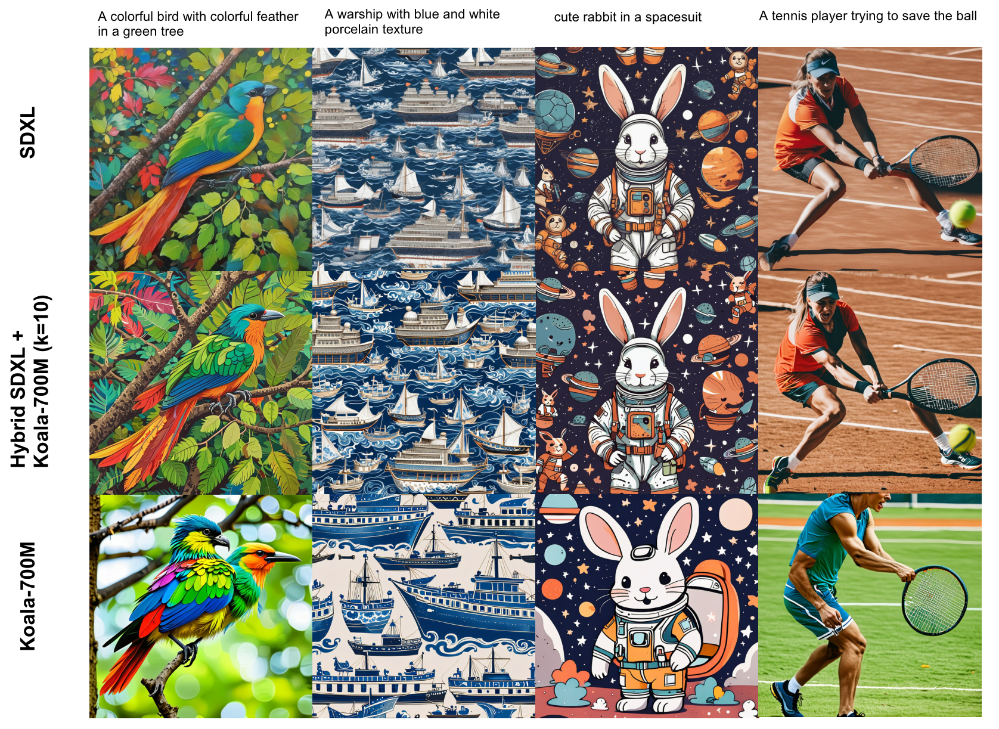
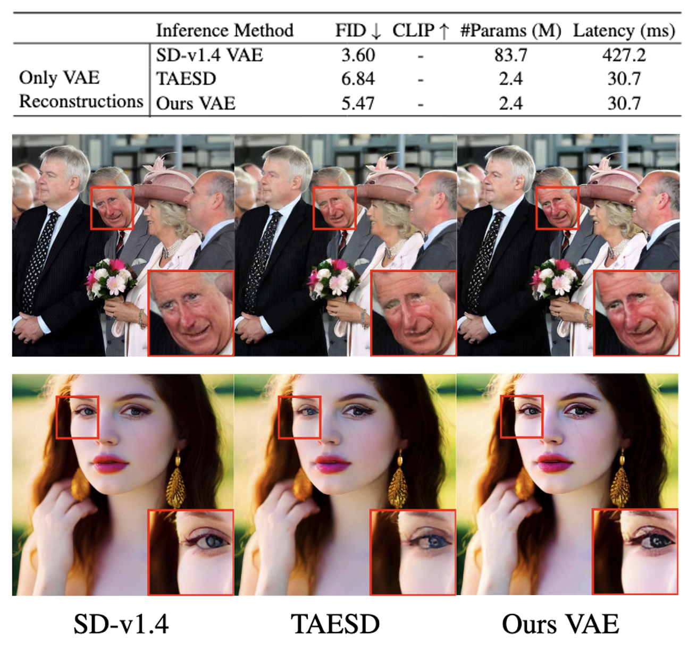

<div align="center">
<h1> Hybrid SD: Edge-Cloud Collaborative Inference for Stable Diffusion Models  
</h1>  

<a href="https://arxiv.org/abs/2408.06646">
  -<COLOR>.svg">
</a>
</div>


<div align="center">
<a>
 
</a>
</div>

## **Introduction**
Hybrid SD is a novel framework designed for edge-cloud collaborative inference of Stable Diffusion Models. By integrating the superior large models on cloud servers and efficient small models on edge devices, Hybrid SD achieves state-of-the-art parameter efficiency on edge devices with competitive visual quality.

## Installation

```bash
conda create -n hybrid_sd python=3.9.2
conda activate hybrid_sd
pip install -r requirements.txt
```

## Pretrained Models
We provide a number of pretrained models as follows:
- Ours pruned U-Net (224M): [hybrid-sd-224m](https://huggingface.co/cqyan/hybrid-sd-224m)
- Ours tiny VAE: [hybrid-sd-tinyvae](https://huggingface.co/cqyan/hybrid-sd-tinyvae) and SDXL version: [hybrid-sd-tinyvae-xl](https://huggingface.co/cqyan/hybrid-sd-tinyvae-xl). Additionaly, we provide the decoder pruned version (**speed up 20%+**) of SD1.5 [hybrid-sd-small-vae](https://huggingface.co/cqyan/hybrid-sd-small-vae) and the SDXL [hybrid-sd-small-vae-xl](https://huggingface.co/cqyan/hybrid-sd-small-vae-xl). **Visual results can be found on [Results](#Results).**
- [SD-v1.4](https://huggingface.co/cqyan/hybrid-sd-v1-4-lcm) and Ours pruned LCM (224M) [hybrid-sd-v1-4-lcm-224](https://huggingface.co/cqyan/hybrid-sd-v1-4-lcm-224)

## Hybrid Inference

### **SD Models**
To use hybrid SD for inference, you can launch the `scripts/hybrid_sd/hybird_sd.sh`, please specify the large and small models. For hybrid inference for SDXL models, please refer to `scripts/hybrid_sd/hybird_sdxl.sh` accordingly.

 <details>
  <summary>
  Optional arguments
  </summary>

  - `PATH_MODEL_LARGE`: the large model path.
  - `PATH_MODEL_SMALL`: the small model path.
  - `--step`: the steps distributed to different models. (e.g., "10,15" means the first 10 steps are distributed to the large model, while the last 15 steps are shifted to the small model.)
  - `--seed`: the random seed. 
  - `--img_sz`: the image size.
  - `--prompts_file`: put prompts in the .txt file.
  - `--output_dir`: the output directory for saving generated images.
   </details>


  

### **Latent Consistency Models (LCMs)**

To use hybrid SD for LCMs, you can launch the `scripts/hybrid_sd/hybird_lcm.sh` and specify the large model and small model. You also need to pass `TEACHER_MODEL_PATH` to load VAE, tokenizer, and Text Encoder.


### Evaluation on MS-COCO Benchmark

* Evaluate hybrid inference with SD Models on MS-COCO 2014 30K.
```bash
bash scripts/hybrid_sd/generate_dpm_eval.sh
```

* Evaluate hybrid inference with LCMs on MS-COCO 2014 30K.
```bash
bash scripts/hybrid_sd/generate_lcm_eval.sh
```

## Training

### Pruning U-Net
```bash
# pruning U-Net through significance score.
bash scripts/prune_sd/prune_tiny.sh

# finetuning the pruned U-Net.
bash scripts/prune_sd/kd_finetune_tiny.sh
```
Following [BK-SDM](https://github.com/Nota-NetsPresso/BK-SDM), we use the dataset preprocessed_212k. 


### Training our lightweight VAE

```bash
bash scripts/optimize_vae/train_tinyvae.sh
```

<details>
  <summary>
  Note
  </summary>

  - We use datasets from [Laion_aesthetics_5plus_1024_33M](https://huggingface.co/datasets/MuhammadHanif/Laion_aesthetics_5plus_1024_33M). 
  - We optimize VAE with LPIPS loss and adversarial loss. 
  - We adopt the discriminator from StyelGAN-t along with several data augmentation and degradation techniques for VAE enhancement.
 </details>

 

## Training LCMs
Training accelerated Latent consistency models (LCM) using the following scripts.

1. Distilling SD models to LCMs

```bash
bash scripts/hybrid_sd/lcm_t2i_sd.sh
```

2. Distilling Pruned SD models to LCMs

```bash
bash scripts/hybrid_sd/lcm_t2i_tiny.sh
```


## Results
### Hybrid SDXL Inference
<div align="center">
<a>
 

</a>
</div>

### VAEs

#### Our tiny VAE vs. TAESD
Ours VAE shows better visual quality and detail refinements than TAESD. Ours VAE also achieves better FID scores than TAESD on MSCOCO 2017 5K datasets.
<div align="center">
<a>
 
</a>
</div>

#### Our small VAE vs. Baseline

| Model (fp16)| Latency on V100 (ms) | GPU Memory (MiB)|
|---|:---:|:---:|
|SDXL baseline vae|802.7|19203|
|SDXL [small vae](https://huggingface.co/cqyan/hybrid-sd-small-vae-xl) (Ours)|611.8|17469|
|SDXL [tiny vae](https://huggingface.co/cqyan/hybrid-sd-tiny-vae-xl) (Ours)|61.1|8017|
|SD1.5 baseline vae|186.6|12987|
|SD1.5 [small vae](https://huggingface.co/cqyan/hybrid-sd-small-vae) (Ours)|135.6|9087|
|SD1.5 [tiny vae](https://huggingface.co/cqyan/hybrid-sd-tiny-vae) (Ours)|16.4|6929|


<div align="center">
<a>
 
</a>
</div>


## Acknowledgments
- [CompVis](https://github.com/CompVis/latent-diffusion), [Runway](https://runwayml.com/), and [Stability AI](https://stability.ai/) for the pioneering research on Stable Diffusion.
- [Diffusers](https://github.com/huggingface/diffusers), [BK-SDM](https://github.com/Nota-NetsPresso/BK-SDM/), [TAESD](https://github.com/madebyollin/taesd) for their valuable contributions.


## Citation
If you find our work helpful, please cite it!
```
@article{yan2024hybrid,
  title={Hybrid SD: Edge-Cloud Collaborative Inference for Stable Diffusion Models},
  author={Yan, Chenqian and Liu, Songwei and Liu, Hongjian and Peng, Xurui and Wang, Xiaojian and Chen, Fangming and Fu, Lean and Mei, Xing},
  journal={arXiv preprint arXiv:2408.06646},
  year={2024}
}
```

## License
This project is licensed under the [Apache-2.0 License](LICENSE).
