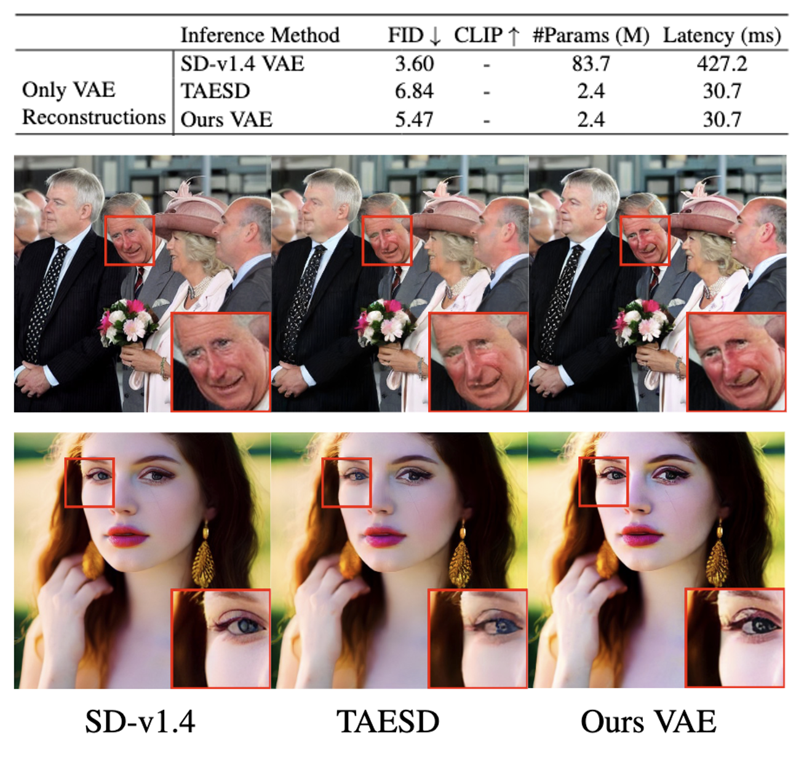
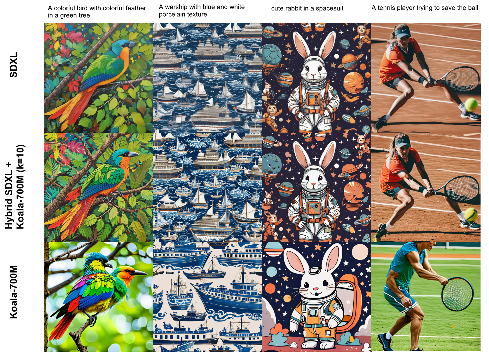

<div align="center">
<h1> Hybrid SD: Edge-Cloud Collaborative Inference for Stable Diffusion Models  
</h1>  

<a href="https://arxiv.org/abs/2408.06646">
  -<COLOR>.svg">
</a>
</div>


<div align="center">
<a>
 
</a>
</div>


## **Introduction**
Hybrid SD is a novel framework designed for edge-cloud collaborative inference of Stable Diffusion Models. By integrating the superior large models on cloud servers and efficient small models on edge devices, Hybrid SD achieves state-of-the-art parameter efficiency on edge devices with competitive visual quality.

## Install
conda create -n hybrid_sd python=3.9.2
conda activate hybrid_sd
```bash
pip install -r requirements.txt
```

## Pretrained Models
We provide a number of pretrained models as follows:
- Ours pruned U-Net (225M): [U-Net](https://)
- Ours VAE: [VAE](https://)
- Ours pruned LCM: [LCM](https://)
- SD-v1.4 LCM: [SD-LCM](https://)

## Hybrid Inference

- #### **SD Models**
To use hybrid SD for inference, you can launch the `scripts/hybrid_sd/hybird_sd.sh`, please specify the large and small models.

```bash
# scripts/hybrid_sd/hybird_sd.sh
step_list=("0,25"  "10,15"  "25,0")


for STEP in ${step_list[@]}
do
    OUTPUT_DIR=results/HybridSD_dpm_guidance7_visual/$MODEL_LARGE-$MODEL_SMALL-$STEP
    CUDA_VISIBLE_DEVICES=$GPU_NUM python3 examples/hybrid_sd/hybrid.py \
            --model_id $PATH_MODEL_LARGE $PATH_MODEL_SMALL\
            --steps $STEP  \
            --prompts_file examples/hybrid_sd/prompts_realistic.txt \
            --seed 1674753452 \
            --img_sz 512 \
            --output_dir $OUTPUT_DIR \
            --num_images_per_prompt 1 \
            --num_images 1 \
            --enable_xformers_memory_efficient_attention \
            --save_middle \
            --use_dpm_solver \
            --guidance_scale 7
done
```

Optional arguments:
- `PATH_MODEL_LARGE`: the large model path.
- `PATH_MODEL_SMALL`: the small model path.
- `--step`: the steps distributed to different models. (e.g., "10,15" means the first 10 steps are distributed to the large model, while the last 15 steps are shifted to the small model.)
- `--seed`: the random seed. 
- `--img_sz`: the image size.
- `--prompts_file`: put prompts in the .txt file.
- `--output_dir`: the output directory for saving generated images.


For hybrid inference for SDXL models, please refer to `scripts/hybrid_sd/hybird_sdxl.sh` accordingly.

- #### **Latent Consistency Models (LCMs)**

To use hybrid SD for LCMs, you can launch the `scripts/hybrid_sd/hybird_lcm.sh` and specify the large model and small model. You also need to pass `TEACHER_MODEL_PATH` to load VAE, tokenizer, and Text Encoder.

```bash
# scripts/hybrid_sd/hybird_lcm.sh
MODEL_LARGE=runwayml--stable-diffusion-v1-4
MODEL_ROOT=pretrained_models
TEACHER_MODEL_PATH=$MODEL_ROOT/$MODEL_LARGE
PATH_MODEL_LARGE="results/lcm_sd14_2w/checkpoint-20000"
PATH_MODEL_SMALL="results/nota-ai--bk-sdm-tiny_LCM/checkpoint-20000"
step_list=("0,8" "4,4"  "8,0")


for STEP in ${step_list[@]}
do
    OUTPUT_DIR=results/HybridSD_LCM_guidance7/$MODEL_LARGE-$MODEL_SMALL-$STEP
    CUDA_VISIBLE_DEVICES=$GPU_NUM python3 examples/hybrid_sd/hybrid_LCM.py \
            --model_id $PATH_MODEL_LARGE $PATH_MODEL_SMALL\
            --pretrained_teacher_model $TEACHER_MODEL_PATH \
            --steps $STEP  \
            --prompts_file examples/hybrid_sd/prompts_realistic.txt \
            --seed 1674753452 \
            --img_sz 512 \
            --output_dir $OUTPUT_DIR \
            --num_images_per_prompt 1 \
            --num_images 1 \
            --enable_xformers_memory_efficient_attention \
            --save_middle \
            --use_dpm_solver \
            --guidance_scale 7
done
```


## Pruning U-Net


- #### **Pruning U-Net through significance score**

1. We use the following scripts to analyze the significance score of each layer of the U-Net. The results will be saved in `results/NaivePrune/$base_arch/prune_oneshot` by default.
```bash
bash scripts/prune_sd/gen_latent.sh
```

2. Then we analyze the score of each candidate pruning layer based on the predicted latents. We will get the `score.pkl` using the following code. 
```python3
python3 examples/prune_sd/analyze_score.py
```

3. Prune the U-Net based on the calculated `score.pkl`
```bash
bash scripts/prune_sd/prune_tiny.sh

# Specify the score file path by `--score_file`.
```


- #### **Finetuning Pruned U-Net**
We follow [BK-SDM](https://github.com/Nota-NetsPresso/BK-SDM) to finetune the pruned U-Net.
```bash
bash scripts/prune_sd/kd_finetune_tiny.sh

# Specify the teacher model path by `--pretrained_model_name_or_path` and the student model path by `--unet_config_path`. 
```
Following [BK-SDM](https://github.com/Nota-NetsPresso/BK-SDM), we use the dataset preprocessed_212k. 

### Training our lightweight VAE
The following script is used to train our lightweight VAE. We use datasets from [Laion_aesthetics_5plus_1024_33M](https://huggingface.co/datasets/MuhammadHanif/Laion_aesthetics_5plus_1024_33M).
```bash
bash scripts/optimize_vae/train_tinyvae.sh
```

### Comparisons between our lightweight VAE and TAESD

<div align="center">
<a>
 
</a>
</div>


## Training LCMs
Training accelerated Latent consistency models (LCM) using the following scripts.

### **1. Distilling SD models to LCMs**
Using the following scripts to distill SD models to LCMs.
```bash
bash scripts/hybrid_sd/lcm_t2i_sd.sh
```

### **2. Distilling Pruned SD models to LCMs**
Use the following scripts to distill our pruned tiny SD models to LCMs.
```bash
bash scripts/hybrid_sd/lcm_t2i_tiny.sh
```


## Evaluation on MS-COCO Benchmark

1. Evaluate hybrid inference with the large model SD-v1.4 and the small model our tiny U-Net on MS-COCO 2014 30K.
```bash
bash scripts/hybrid_sd/generate_dpm_eval.sh
```

2. Evaluate hybrid inference with LCMs on MS-COCO 2014 30K.
```bash
bash scripts/hybrid_sd/generate_lcm_eval.sh
```


## Results
<div align="center">
<a>
 

</a>
</div>
