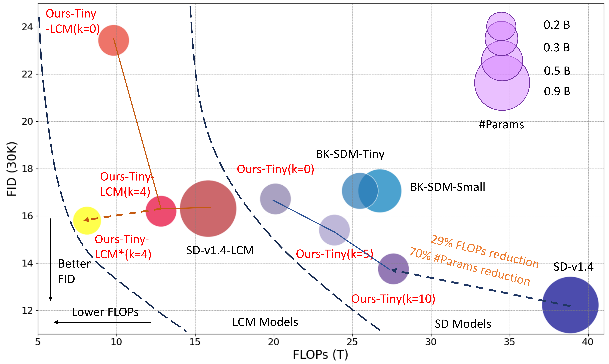

<div align="center">
<h1> Hybrid SD: Edge-Cloud Collaborative Inference for Stable Diffusion Models  
</h1>  

<a href="https://arxiv.org/abs/2408.06646">
  -<COLOR>.svg">
</a>
</div>

<a>
 

  

</a>


## **Introduction**
Hybrid SD is a novel framework designed for edge-cloud collaborative inference of Stable Diffusion Models. By integrating the superior large models on cloud servers and efficient small models on edge devices, Hybrid SD achieves state-of-the-art parameter efficency on edge devices with competitive visual quality.

## Install
conda create -n hybrid_sd python=3.9.2
conda activate hybrid_sd
```bash
pip install -r requirements.txt
```

## Usage


### Hybrid Inference

- #### **SD Models**
To use hybrid SD for inference, you can luanch the `scripts/hybrid_sd/hybird_sd.sh`, please specify the large model and small model.

```bash
# scripts/hybrid_sd/hybird_sd.sh
step_list=("0,25"  "10,15"  "25,0")


for STEP in ${step_list[@]}
do
    OUTPUT_DIR=results/HybridSD_dpm_guidance7_visual/$MODEL_LARGE-$MODEL_SMALL-$STEP
    CUDA_VISIBLE_DEVICES=$GPU_NUM python3 examples/hybrid_sd/hybrid.py \
            --model_id $PATH_MODEL_LARGE $PATH_MODEL_SMALL\
            --steps $STEP  \
            --prompts_file examples/hybrid_sd/prompts_realistic.txt \
            --seed 1674753452 \
            --img_sz 512 \
            --output_dir $OUTPUT_DIR \
            --num_images_per_prompt 1 \
            --num_images 1 \
            --enable_xformers_memory_efficient_attention \
            --save_middle \
            --use_dpm_solver \
            --guidance_scale 7
done
```

Optional arguments:
- `PATH_MODEL_LARGE`: the large model path.
- `PATH_MODEL_SMALL`: the small model path.
- `--step`: the steps distributed to different models. (e.g., "10,15" means the first 10 steps is distributed to the large model, and the last 15 steps is shifted sto the small model.)
- `--seed`: the random seed. 
- `--img_sz`: the image size.
- `--prompts_file`: put prompts in the .txt file.
- `--output_dir`: the output directory for saving generated images.


For hybrid SD for SDXL models, please refer to `scripts/hybrid_sd/hybird_sdxl.sh` accordinly.

- #### **Latent Consistency Models (LCMs)**

To use hybrid SD for LCMs, you can luanch the `scripts/hybrid_sd/hybird_lcm.sh` and specify the large model and small model.

```bash
# scripts/hybrid_sd/hybird_lcm.sh
MODEL_LARGE=runwayml--stable-diffusion-v1-4
PATH_MODEL_LARGE="/mnt/bn/bytenn-yg2/liuhj/hybrid_sd/bytenn_diffusion_tools/results/lcm_sd14_2w/checkpoint-20000"
PATH_MODEL_SMALL=/mnt/bn/bytenn-yg2/liuhj/hybrid_sd/bytenn_diffusion_tools/results/nota-ai--bk-sdm-tiny_LCM/checkpoint-20000
step_list=("0,8" "4,4"  "8,0")


for STEP in ${step_list[@]}
do
    OUTPUT_DIR=results/HybridSD_LCM_guidance7/$MODEL_LARGE-$MODEL_SMALL-$STEP
    CUDA_VISIBLE_DEVICES=$GPU_NUM python3 examples/hybrid_sd/hybrid_LCM.py \
            --model_id $PATH_MODEL_LARGE $PATH_MODEL_SMALL\
            --steps $STEP  \
            --prompts_file examples/hybrid_sd/prompts_realistic.txt \
            --seed 1674753452 \
            --img_sz 512 \
            --output_dir $OUTPUT_DIR \
            --num_images_per_prompt 1 \
            --num_images 1 \
            --enable_xformers_memory_efficient_attention \
            --save_middle \
            --use_dpm_solver \
            --guidance_scale 7
done
```


### Pruning U-Net


- #### **Pruning U-Net through**


- #### **Finetuning Pruned U-Net**
We follow [BK-SDM](https://github.com/Nota-NetsPresso/BK-SDM) to finetune the pruned U-Net.


### Training LCMs
Training accelerated Latent consistency models (LCM) using the following scripts.

- ### **Distilling SD models to LCMs**
Using the following scripts to distill SD models to LCMs.
```bash
bash scripts/hybrid_sd/lcm_t2i_sd.sh
```

- ### **Distilling Pruned SD models to LCMs**
Using the following scripts to distill ours pruned SD models to LCMs.
```bash
bash scripts/hybrid_sd/lcm_t2i_tiny.sh
```


### Results
<div align="center">
<a>
 

</a>
</div>


### Replacing the VAE with our lightweight VAE